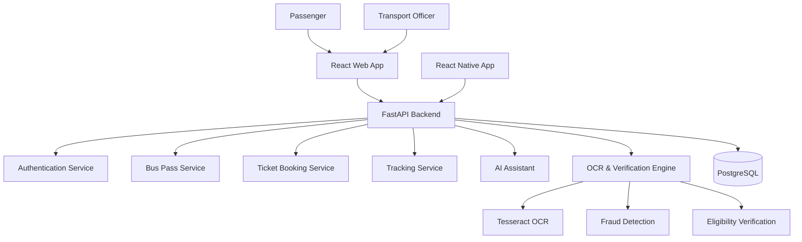

# 🚌 MobiTN - AI Powered Smart Public Transport Platform

MobiTN is a next-generation smart mobility platform designed for Tamil Nadu. The platform modernizes public transportation services through AI-powered verification, digital bus passes, route intelligence, ticket booking, real-time transit information, and administrative analytics.

The system is designed to serve both commuters and transport authorities through a unified Web and Mobile ecosystem.

---

# 🎯 Vision

To create a unified digital ecosystem for Tamil Nadu public transportation that improves accessibility, transparency, efficiency, and citizen experience using Artificial Intelligence, automation, and smart mobility technologies.

---

# 🏛️ System Architecture



---

# 🚀 Core Features

## 1. User Authentication

* JWT Authentication
* Secure Login & Registration
* User Profile Management
* Role Based Access Control
* Admin and Passenger Accounts

---

## 2. Smart Bus Pass Management

### Available Pass Types

#### Student Pass

* Monthly Pass
* Subsidized Fare
* College Verification Required

#### Adult Pass

* Monthly Pass
* Standard Fare

#### Senior Citizen Pass

* Concession Fare
* Age Verification Required

### Features

* Digital Bus Pass Application
* Aadhaar Verification
* Document Upload
* QR Pass Generation
* Pass Renewal
* Application Status Tracking

---

## 3. AI Powered Verification System

### OCR Processing

Extracts:

* Name
* Date of Birth
* Aadhaar Details
* Address Information

using:

* Tesseract OCR
* Image Processing Pipeline

### Eligibility Verification

Automatically validates:

* Student Eligibility
* Senior Citizen Eligibility
* Document Completeness

### Fraud Detection

Detects:

* Duplicate Applications
* Repeated Aadhaar Usage
* Suspicious Records

### Verification Score

Each application receives:

* Eligibility Score
* Fraud Risk Score
* Verification Status

---

## 4. Route Information System

Provides:

* Chennai Route Database
* Route Search
* Stop Information
* Route Details
* Route Management

Users can search:

```text
Source → Destination
```

and receive:

* Available Routes
* Intermediate Stops
* Travel Information
* Estimated Travel Time

---

## 5. Live Bus Tracking

Features:

* Google Maps Integration
* Route Visualization
* Current Bus Location
* ETA Display
* Route Monitoring

Current implementation supports:

* Simulated GPS Tracking

Future roadmap:

* Real GPS Device Integration
* Government API Integration
* Driver App Tracking

---

## 6. Ticket Booking System

Users can:

* Search Routes
* Select Seats
* Book Tickets
* View Booking History
* Download QR Tickets

Features:

* Interactive Seat Selection
* Booking Confirmation
* QR Ticket Generation

---

## 7. AI Transport Assistant

Custom-built AI Assistant without external AI APIs.

### Supported Languages

* English
* Tamil

### Capabilities

* Route Search Assistance
* Pass Application Help
* Fare Enquiry
* Ticket Booking Guidance
* Bus Tracking Information
* General Transport Support

### Technologies

* Scikit-Learn
* TF-IDF
* Logistic Regression
* Semantic FAQ Retrieval

No dependency on:

* OpenAI
* Gemini
* Claude APIs

---

## 8. Admin Dashboard

Transport officers can:

### Manage Applications

* Approve Passes
* Reject Passes
* Review Documents

### Route Management

* Add Routes
* Update Routes
* Delete Routes

### Analytics

* Active Passes
* Passenger Statistics
* Booking Analytics
* Route Usage Statistics

---

# 🛠️ Technology Stack

## Backend

* FastAPI
* Python 3.10+
* SQLAlchemy
* PostgreSQL
* JWT Authentication

## Frontend

* React.js
* Vite
* Tailwind CSS
* Axios

## Mobile

* React Native
* Expo

## Artificial Intelligence

* Scikit-Learn
* Tesseract OCR
* Custom NLP Engine

## Maps

* Google Maps API

## Infrastructure

* Docker
* Docker Compose

---

# 💾 Database Modules

## Users

Stores:

* User Profile
* Login Credentials
* Role Information

## Bus Passes

Stores:

* Pass Type
* Verification Status
* Eligibility Score
* QR Data

## Routes

Stores:

* Route Number
* Origin
* Destination
* Stops

## Buses

Stores:

* Bus Information
* GPS Data
* Route Mapping

## Bookings

Stores:

* Ticket Bookings
* Seat Information
* Payment Details

---

# 🔐 Security Features

* JWT Authentication
* Password Hashing
* Role-Based Access
* Aadhaar Masking
* Secure API Access
* Input Validation

Sensitive Aadhaar information is never stored in plain text.

---

# 📈 Current Development Status

## Completed

* Authentication Module
* Bus Pass Module
* OCR Integration
* Fraud Detection
* Route Information Module
* Ticket Booking Module
* Admin Dashboard
* QR Code Generation
* Google Maps Integration
* AI Assistant
* Route Management

## In Progress

* Mobile Application
* Real-Time GPS Integration
* Demand Prediction
* Occupancy Prediction
* Smart Route Recommendation

---

# 🎯 Future Enhancements

## AI Demand Prediction

Predict:

* Peak Hour Traffic
* Passenger Volume
* Route Demand

## Smart Route Recommendation

Recommend:

* Best Route
* Fastest Route
* Least Crowded Route

## Occupancy Prediction

Estimate:

* Bus Occupancy
* Seat Availability
* Peak Travel Periods

## Government Integration

Potential integration with:

* MTC
* TNSTC
* SETC
* CUMTA

subject to approvals and API availability.

---

# 🚀 Setup Instructions

## Backend

```bash
cd backend
python -m venv venv
venv\Scripts\activate
pip install -r requirements.txt
uvicorn app.main:app --reload
```

## Frontend

```bash
cd frontend
npm install
npm run dev
```

## Mobile

```bash
cd mobile
npx expo start
```

---

# 👨‍💻 Developed By

**MobiTN Team**

AI-Powered Smart Mobility Solution for Tamil Nadu

Built using Artificial Intelligence, Machine Learning, OCR, GIS Mapping, and Modern Web Technologies.
