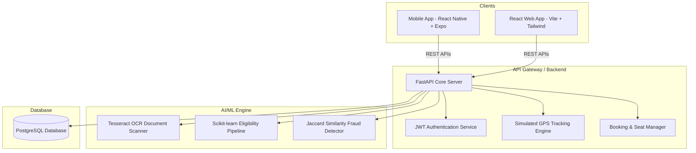

# 🚌 Tamil Nadu Smart Public Transport Platform

A production-ready, AI-augmented transit platform built for Tamil Nadu. The system operates as a unified platform supporting both a responsive Web Application and an Expo Mobile App, managed by an intelligent FastAPI backend.

---

## 🏛️ System Architecture



---

## 🚀 Core Features

1. **User Authentication**: Secure JWT-token authentication supporting registration and sign-in via email/phone.
2. **Online Bus Pass**: Categorized pass applications (Student, General, Senior Citizen) with image uploading. Student passes are free in Tamil Nadu.
3. **Machine Learning Pipeline**:
   - **Document OCR**: Automatically extracts text from uploaded identity documents using Tesseract OCR.
   - **Eligibility Model**: Evaluates passenger eligibility using a Scikit-learn classifier pipeline based on demographic factors.
   - **Fraud Detection**: Cross-checks application text with existing records for duplicate submissions using Jaccard Similarity.
4. **Interactive Bus Tracking**: Simulates real-time GPS coordinates. Panning maps move buses along their routes with dynamic speed and ETA calculations.
5. **Seat Bookings**: Displays interactive 40-seat grids, blocking booked seats and generating digital QR-code tickets.
6. **Officer Admin Panel**: Admin tools to review/approve passes, inspect OCR data, manage routes (CRUD), and review analytics dashboards.

---

## 🛠️ Tech Stack

- **Backend**: FastAPI (Python 3.10+), SQLAlchemy ORM, PostgreSQL database driver.
- **Frontend Web**: React.js, Tailwind CSS v3, Zustand State Management, Leaflet Maps, Recharts.
- **Mobile App**: React Native (Expo framework), Custom state-based navigation stack.
- **Machine Learning**: Scikit-learn (LogisticRegression + StandardScaler pipeline), Tesseract OCR (Pytesseract), Pillow.
- **Infrastructure**: Docker & Docker Compose.

---

## 💾 Database Schema

The system initializes the following relational database schema under PostgreSQL:

### `users`
- `id` (Primary Key): Unique Integer serial
- `email` / `phone` (Unique Index): Auth identifier
- `password_hash`: Bcrypt hashed string
- `full_name`: Passenger name
- `role`: "user" or "admin" (seeds `admin@tn.gov.in`)
- `city`: Location (defaults to "Chennai")

### `bus_passes`
- `id` (Primary Key)
- `user_id` (Foreign Key -> `users.id`)
- `category`: "student", "general", or "senior_citizen"
- `pass_type`: "monthly", "quarterly", or "annual"
- `document_url`: Upload path to static image
- `ocr_extracted_text`: Scanned textual output
- `ml_eligibility_score`: Scikit-learn eligibility confidence float
- `fraud_risk_score`: Duplicate similarity float
- `status`: "pending", "approved", "rejected"
- `valid_from` / `valid_until`: Date ranges
- `amount` / `payment_status`: Checkout attributes
- `qr_code_url` / `qr_code_data`: Base64 PNG scanning block

### `buses`
- `id` (Primary Key)
- `bus_number` / `bus_name` / `bus_type`
- `source` / `destination`: Key stations
- `stops` (JSON): Ordered stops coordinate array
- `current_lat` / `current_lng`: Real-time telemetry coordinates
- `current_speed` / `heading`: Simulated velocity and bearing
- `status`: "idle" or "running"

### `bookings`
- `id` (Primary Key)
- `user_id` (Foreign Key -> `users.id`)
- `bus_id` (Foreign Key -> `buses.id`)
- `source` / `destination` / `travel_date`
- `seat_number`: Comma-separated seat string
- `amount` / `payment_status`: Sales tracking

### `tickets`
- `id` (Primary Key)
- `booking_id` (Foreign Key -> `bookings.id`)
- `qr_data` / `qr_code_url`: Base64 checkout validator
- `ticket_number`: Unique invoice code

---

## ⚡ Setup Instructions

### Option A: Running with Docker Compose (Recommended)

1. Make sure you have **Docker** and **Docker Compose** installed on your system.
2. In the root project directory, spin up all containers:
   ```bash
   docker-compose up --build
   ```
3. Docker will launch:
   - **PostgreSQL**: Accessible on port `5432`
   - **FastAPI Backend**: Accessible on `http://localhost:8000` (API documentation at `http://localhost:8000/docs`)
   - **React Frontend**: Accessible on `http://localhost:3000`

---

### Option B: Local Manual Setup

If you prefer to run the components directly on your host machine:

#### 1. Database Setup
- Install PostgreSQL and create a database named `tn_transport`.
- Set user credentials matching the environment variables:
  - User: `tn_admin`
  - Password: `tn_secure_pass_2024`

#### 2. Backend Setup
1. Navigate to the backend directory:
   ```bash
   cd backend
   ```
2. Create and activate a Python virtual environment:
   ```bash
   python -m venv venv
   # On Windows:
   venv\Scripts\activate
   # On macOS/Linux:
   source venv/bin/activate
   ```
3. Install dependencies:
   ```bash
   pip install -r requirements.txt
   ```
4. Start the FastAPI server (it automatically seeds initial users and buses on startup!):
   ```bash
   uvicorn app.main:app --reload --port 8000
   ```

#### 3. React Frontend Setup
1. Navigate to the frontend directory:
   ```bash
   cd ../frontend
   ```
2. Install npm packages:
   ```bash
   npm install
   ```
3. Start the dev server:
   ```bash
   npm run dev
   ```
4. Open `http://localhost:5173` in your browser.

#### 4. Mobile App Setup (Expo)
1. Navigate to the mobile directory:
   ```bash
   cd ../mobile
   ```
2. Start the Expo server:
   ```bash
   npx expo start
   ```
3. Press `w` to test on web, or scan the QR code using the Expo Go application on a mobile device.

---

## 🔐 Demo Credentials

The database seeder automatically creates two credentials to test the platform:

| Role | Username / Email | Password |
|---|---|---|
| **Admin Officer** | `admin@tn.gov.in` | `admin_password_123` |
| **Passenger** | `user@gmail.com` | `user1234` |

---

## 🧪 Testing Guide & Walkthrough

1. **User Sign In**: Open `http://localhost:5173/login` (or the mobile screen) and sign in using the **Passenger** credential.
2. **Apply Bus Pass**:
   - Navigate to **Bus Pass**.
   - Click "Attach document" and submit.
   - The UI will display a scan loader showing the real-time AI OCR text extraction, eligibility check, and fraud check running on the backend.
   - Note: Since the pass is in the *pending* state, sign out and sign in using the **Admin** credential to approve it.
3. **Admin Review**:
   - Go to the **Admin Panel** tab.
   - Under **Pass Applications**, review the OCR results, check the eligibility score, and click **Approve**.
   - Sign back in as the **Passenger** to view the active pass showing a generated QR code for conductor scanning.
4. **Ticket Booking**:
   - Navigate to **Book Tickets**.
   - Search for the route: Source: `Chennai`, Destination: `Madurai`.
   - Click the search result, choose seats in the interactive grid, and click "Confirm".
   - The ticket displays a booking QR ticket immediately.
5. **Live GPS Bus Tracking**:
   - Go to **Live Tracking**.
   - Select the `Route 17D City Service` or `ECR Deluxe Tourer`.
   - Every 4 seconds, the bus position updates. Watch the vehicle move in real-time along the map coordinates with telemetry data updating.
