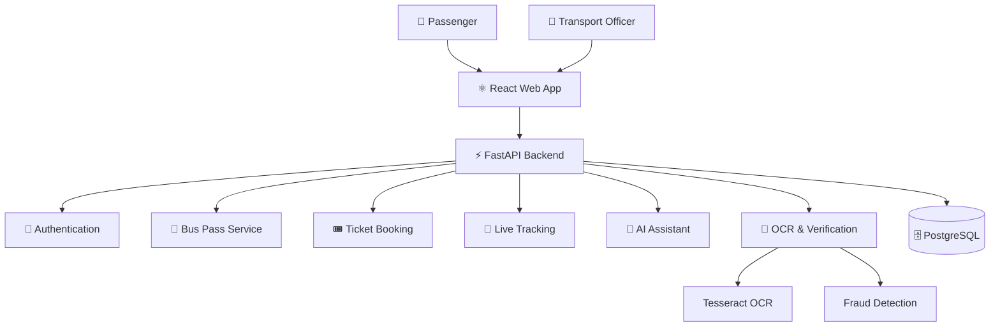

<p align="center">
  <h1 align="center">🚌 MobiTN — AI-Powered Smart Public Transport Platform</h1>
  <p align="center">
    A next-generation smart mobility platform for Tamil Nadu, built with AI, Machine Learning, and modern web technologies.
  </p>
</p>

<p align="center">
  <a href="#-features"></a>
  <a href="./LICENSE"></a>
  
  
  
  
  
</p>

---

## 🎯 Vision

To create a unified digital ecosystem for Tamil Nadu public transportation that improves accessibility, transparency, efficiency, and citizen experience using Artificial Intelligence, automation, and smart mobility technologies.

---

## 🏛️ System Architecture



---

## 🚀 Features

| # | Feature | Description |
|---|---------|-------------|
| 1 | **User Authentication** | JWT + Supabase dual-auth, role-based access control (Admin/Passenger) |
| 2 | **Smart Bus Pass** | Digital pass application with Aadhaar OCR verification (Student, Adult, Senior) |
| 3 | **AI Verification** | Tesseract OCR, eligibility scoring, fraud detection — no external AI APIs |
| 4 | **Route Information** | 120+ Chennai MTC bus routes with stage-by-stage stop sequences |
| 5 | **Fare Calculator** | Stage-wise fares for 11 service types (Ordinary to Premium) |
| 6 | **Live Bus Tracking** | Real-time GPS tracking with Google Maps integration |
| 7 | **Ticket Booking** | Interactive seat selection, QR ticket generation, booking history |
| 8 | **AI Chatbot** | Bilingual (English/Tamil) transport assistant — built with scikit-learn |
| 9 | **Admin Dashboard** | Pass approval, route management, analytics & statistics |
| 10 | **QR Code System** | Digital QR passes and tickets for contactless boarding |
| 11 | **Bus Pass Forms** | PDF forms for Senior Citizen and School Student free bus passes |

---

## 🛠️ Tech Stack

### Backend
- **Framework:** FastAPI (Python 3.10+)
- **Database:** PostgreSQL 15 + SQLAlchemy 2.x ORM
- **Auth:** JWT (python-jose) + Supabase Auth
- **AI/ML:** scikit-learn, Tesseract OCR, TF-IDF NLP
- **Server:** Gunicorn + Uvicorn workers

### Frontend
- **Framework:** React 18 + Vite
- **Styling:** Tailwind CSS
- **State:** Zustand
- **Maps:** Google Maps API
- **Icons:** Lucide React

### Infrastructure
- **Containerization:** Docker + Docker Compose
- **Database Hosting:** Supabase (PostgreSQL)
- **Production Server:** Nginx (frontend), Gunicorn (backend)

---

## 📦 Quick Start

### Prerequisites
- Python 3.10+
- Node.js 18+
- PostgreSQL 15+ (or Supabase account)
- Google Maps API key

### Backend Setup

```bash
cd backend
python -m venv venv
venv\Scripts\activate              # Windows
# source venv/bin/activate         # macOS/Linux
pip install -r requirements.txt
cp .env.example .env               # Fill in your credentials
uvicorn app.main:app --reload
```

The API will be available at `http://localhost:8000` with interactive docs at `/docs`.

### Frontend Setup

```bash
cd frontend
npm install
cp .env.example .env               # Fill in your credentials
npm run dev
```

The app will be available at `http://localhost:5173`.

### Docker Setup (Full Stack)

```bash
docker-compose up --build
```

| Service   | URL                    |
|-----------|------------------------|
| Frontend  | http://localhost:3000   |
| Backend   | http://localhost:8000   |
| API Docs  | http://localhost:8000/docs |
| Database  | localhost:5432         |

---

## 🔐 Environment Variables

### Backend (`backend/.env`)
| Variable | Description |
|----------|-------------|
| `DATABASE_URL` | PostgreSQL connection string |
| `SUPABASE_URL` | Supabase project URL |
| `SUPABASE_ANON_KEY` | Supabase anonymous key |
| `SECRET_KEY` | JWT signing secret (change in production!) |
| `CORS_ORIGINS` | Allowed frontend origins |

### Frontend (`frontend/.env`)
| Variable | Description |
|----------|-------------|
| `VITE_API_URL` | Backend API URL |
| `VITE_SUPABASE_URL` | Supabase project URL |
| `VITE_SUPABASE_ANON_KEY` | Supabase anonymous key |
| `VITE_GOOGLE_MAPS_API_KEY` | Google Maps JavaScript API key |

See `.env.example` files in each directory for templates.

---

## 📁 Project Structure

```
TN/
├── backend/
│   ├── app/
│   │   ├── api/          # Route handlers (auth, booking, bus_pass, etc.)
│   │   ├── core/         # Config, security, dependencies
│   │   ├── db/           # Database session, init, seed data
│   │   ├── ml/           # AI/ML modules (chatbot, OCR, verification)
│   │   ├── models/       # SQLAlchemy ORM models
│   │   ├── schemas/      # Pydantic validation schemas
│   │   ├── services/     # Business logic layer
│   │   ├── utils/        # Aadhaar masking, helpers
│   │   └── main.py       # FastAPI application entry point
│   ├── Dockerfile
│   └── requirements.txt
├── frontend/
│   ├── src/
│   │   ├── components/   # Reusable UI components
│   │   ├── pages/        # Page-level components (11 pages)
│   │   ├── services/     # API client & Supabase client
│   │   ├── store/        # Zustand state management
│   │   ├── App.jsx       # Router & layout
│   │   └── index.css     # Tailwind + custom styles
│   ├── Dockerfile
│   └── nginx.conf
├── docs/                 # Reference documents (PDF forms)
├── docker-compose.yml
├── CONTRIBUTING.md
├── LICENSE
└── README.md
```

---

## 🔒 Security

- **Password Hashing:** bcrypt via passlib
- **JWT Tokens:** Signed with HS256, 24-hour expiry
- **Aadhaar Protection:** Numbers stored masked (XXXX XXXX 1234)
- **Role-Based Access:** Admin and Passenger roles with route guards
- **Input Validation:** Pydantic schemas on all API endpoints
- **CORS:** Configurable allowed origins
- **Docker:** Non-root container user

---

## 📈 Current Status

### ✅ Completed
- Authentication Module (JWT + Supabase)
- Bus Pass Module (Application, OCR, QR)
- AI Verification Engine (OCR, Fraud Detection, Eligibility)
- Route Information (120+ Chennai MTC routes)
- Stage-wise Fare Chart (11 service categories)
- Ticket Booking System (Seat selection, QR tickets)
- Live Bus Tracking (Google Maps)
- AI Transport Assistant (Bilingual)
- Admin Dashboard (Analytics, Approvals)

### 🔄 In Progress
- Mobile Application (React Native)
- Real-Time GPS Integration
- AI Demand Prediction

---

## 🤝 Contributing

Contributions are welcome! Please read [CONTRIBUTING.md](./CONTRIBUTING.md) for guidelines.

---

## 📄 License

This project is licensed under the [MIT License](./LICENSE).

---

## 👨‍💻 Developed By

**MobiTN Team** — AI-Powered Smart Mobility Solution for Tamil Nadu

Built with ❤️ using Artificial Intelligence, Machine Learning, OCR, GIS Mapping, and Modern Web Technologies.
